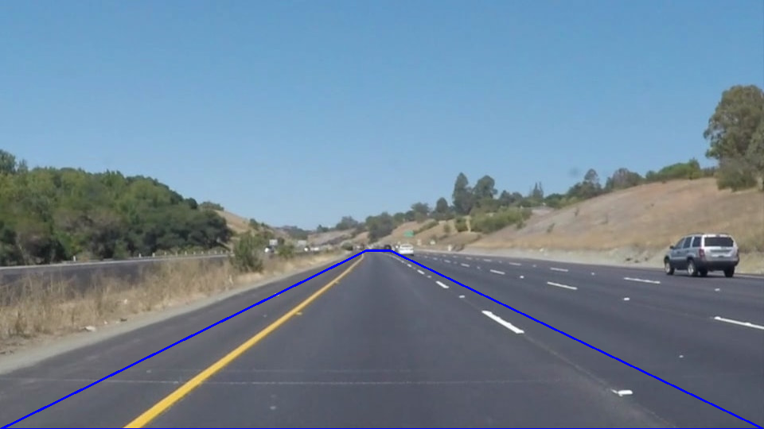
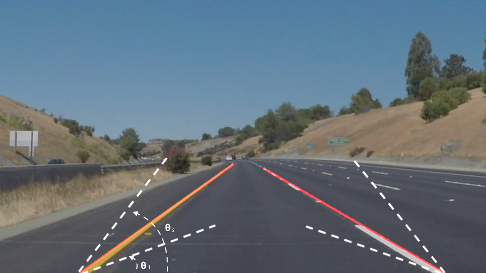
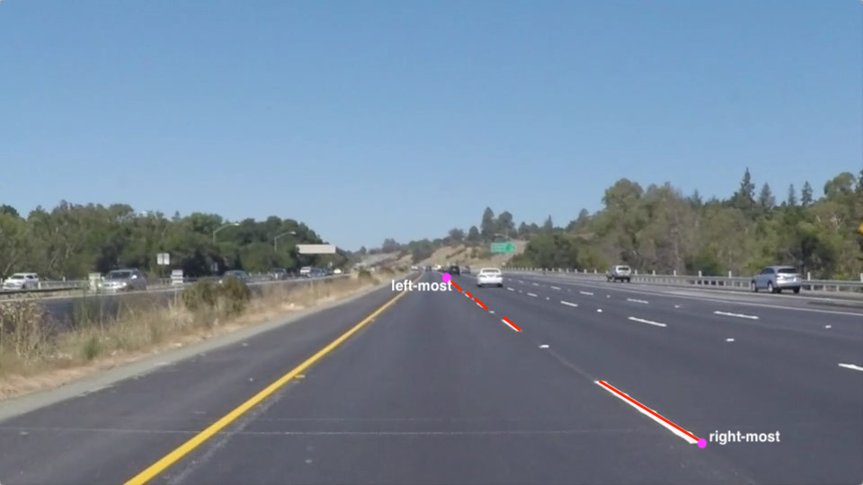

# **Finding Lane Lines on the Road** 

---

**Finding Lane Lines on the Road**

The goals / steps of this project are the following:
* Make a pipeline that finds lane lines on the road
* Reflect on your work in a written report

---

### Reflection

### 1. Describe your pipeline. As part of the description, explain how you modified the draw_lines() function.

My pipeline consisted of the following steps:
- Apply Gaussian smoothing 
- Apply Canny edge detection
- Apply image mask to only keep the region of interest of the image. The region being used is `[[(0,imshape[0]),(460, 315), (520, 315), (imshape[1],imshape[0])]]`  (the blue trapezoidal in the below example)

- Apply Hough transform to find lane line segments
- Connect the line segments and extrapolate them to the bottom of the image to form the lane markings
- Draw the lane markings on the image

In order to draw a single line on the left and right lanes, I modified the draw_lines() function in the following way:

1. In order to filter out noise, I only keep the line segments whose slopes are within a reasonable range. For example, the left marking of the lane should have a slope within the two dashed white lines:

2. For the line segments detected on the markings, I ordered their end points by their x's (horizontal coordinates)

3. Draw the markings by connecting the left-most and right-most end points
4. Extend the markings to the bottom of the image

### 2. Identify potential shortcomings with your current pipeline

One potential shortcoming would be in the draw_lines() function, I believe the approach I used to enhance the draw_lines() is pretty hacky and might not generalized well. The more robust way is to follow the hints in the comment to average the position of each of the lines and extrapolate to the top and bottom of the lane.  One example of the problem for my approache is: if the left-most of right-most line segments are segments not along the marking (false positive), then we might draw wrong line by connecting the left-most and right-most end points, for example

Appearantly, this approach in draw_lines() will fail when the lane marking are curved, because, firstly, drawing a straight line between two endpoints does not fit the curved line; secondly, when the lane markings are curved, the sorting and finding the left-most and right-most end points aren't the correct algorith to find the beginning and ending line segments.

Also, the pipeline is very sensitive to the region of interest (masked region).

### 3. Suggest possible improvements to your pipeline

A possible improvement would be polyfitting lines for the markings instead of draing straight lines; also, I need to use more siganificant algorithms to connecting the line sgements in draw_lines. 

Another possible improve is to do the region masking before all other steps to save computation.

